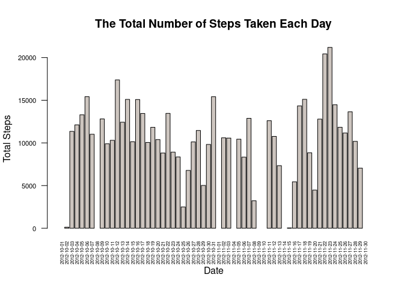
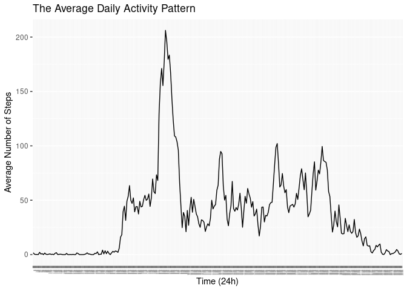
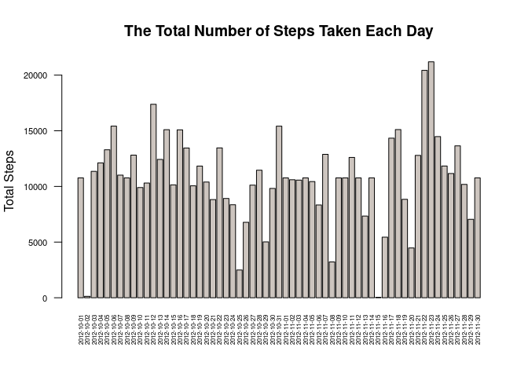
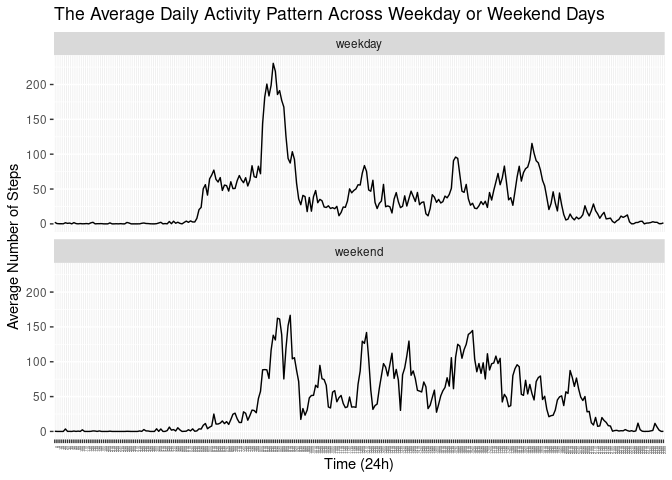

## Introduction
It is now possible to collect a large amount of data about personal movement using activity monitoring devices such as a Fitbit, Nike Fuelband, or Jawbone Up. These type of devices are part of the “quantified self” movement – a group of enthusiasts who take measurements about themselves regularly to improve their health, to find patterns in their behavior, or because they are tech geeks. But these data remain under-utilized both because the raw data are hard to obtain and there is a lack of statistical methods and software for processing and interpreting the data.

This assignment makes use of data from a personal activity monitoring device. This device collects data at 5 minute intervals through out the day. The data consists of two months of data from an anonymous individual collected during the months of October and November, 2012 and include the number of steps taken in 5 minute intervals each day.

The data for this assignment can be downloaded from the course web site:

* Dataset: [Activity monitoring data](https://d396qusza40orc.cloudfront.net/repdata%2Fdata%2Factivity.zip)

The variables included in this dataset are:

* steps: Number of steps taking in a 5-minute interval (missing values are coded as NA)

* date: The date on which the measurement was taken in YYYY-MM-DD format

* interval: Identifier for the 5-minute interval in which measurement was taken

The dataset is stored in a comma-separated-value (CSV) file and there are a total of 17,568 observations in this dataset.

## Loading and preprocessing the data

```r
# Load the 'dplyr' package
library(dplyr)
```

```
## 
## Attaching package: 'dplyr'
```

```
## The following objects are masked from 'package:stats':
## 
##     filter, lag
```

```
## The following objects are masked from 'package:base':
## 
##     intersect, setdiff, setequal, union
```

```r
# Load the 'ggplot2' package
library(ggplot2)
```

```r
# Read csv data
data<-read.csv("./activity.csv")
head(data,10)
```

```
##    steps       date interval
## 1     NA 2012-10-01        0
## 2     NA 2012-10-01        5
## 3     NA 2012-10-01       10
## 4     NA 2012-10-01       15
## 5     NA 2012-10-01       20
## 6     NA 2012-10-01       25
## 7     NA 2012-10-01       30
## 8     NA 2012-10-01       35
## 9     NA 2012-10-01       40
## 10    NA 2012-10-01       45
```

```r
summary(data)
```

```
##      steps            date              interval     
##  Min.   :  0.00   Length:17568       Min.   :   0.0  
##  1st Qu.:  0.00   Class :character   1st Qu.: 588.8  
##  Median :  0.00   Mode  :character   Median :1177.5  
##  Mean   : 37.38                      Mean   :1177.5  
##  3rd Qu.: 12.00                      3rd Qu.:1766.2  
##  Max.   :806.00                      Max.   :2355.0  
##  NA's   :2304
```
## What is mean total number of steps taken per day?
For this part of the assignment, you can ignore the missing values in the dataset.

1. Calculate the total number of steps taken per day

```r
total.steps.perday<-data %>% group_by(date) %>% summarise(total.steps=sum(steps))
head(total.steps.perday,10)
```

```
## # A tibble: 10 × 2
##    date       total.steps
##    <chr>            <int>
##  1 2012-10-01          NA
##  2 2012-10-02         126
##  3 2012-10-03       11352
##  4 2012-10-04       12116
##  5 2012-10-05       13294
##  6 2012-10-06       15420
##  7 2012-10-07       11015
##  8 2012-10-08          NA
##  9 2012-10-09       12811
## 10 2012-10-10        9900
```

2. Make a histogram of the total number of steps taken each day

```r
with(total.steps.perday, 
     barplot(height=total.steps, names=date,
             col='seashell3',
             las=2, cex.names = 0.5,
             xlab="Date", ylab="Total Steps", cex.axis=0.7,
             main="The Total Number of Steps Taken Each Day"))
```

<!-- -->

3. Calculate and report the mean and median of the total number of steps taken per day

```r
total.steps.perday %>% summarize(mean.total.steps=mean(total.steps,na.rm = TRUE))
```

```
## # A tibble: 1 × 1
##   mean.total.steps
##              <dbl>
## 1           10766.
```

```r
total.steps.perday %>% summarize(median.total.steps=median(total.steps,na.rm = TRUE))
```

```
## # A tibble: 1 × 1
##   median.total.steps
##                <int>
## 1              10765
```
## What is the average daily activity pattern?

1. Make a time series plot (i.e. type = "l") of the 5-minute interval (x-axis) and the average number of steps taken, averaged across all days (y-axis)

```r
avg.steps.perint<-data %>% group_by(interval) %>% 
      summarise(average.steps=mean(steps,na.rm=TRUE))
avg.steps.perint[1]<-with(avg.steps.perint,sub("(..)$", ":\\1",interval))
# plot
avg.steps.perint %>% ggplot( aes(x=factor(interval,levels = unique(interval)),y=average.steps))+
      geom_line(aes(group=1))+
      xlab("Time (24h)") + ylab("Average Number of Steps")+
      labs(title="The Average Daily Activity Pattern")+
      theme(axis.text.x=element_text(size=3,angle=90, hjust=1))
```

<!-- -->

2. Which 5-minute interval, on average across all the days in the dataset, contains the maximum number of steps?

```r
avg.steps.perint[which.max(avg.steps.perint[[2]]),]
```

```
## # A tibble: 1 × 2
##   interval average.steps
##   <chr>            <dbl>
## 1 8:35              206.
```

## Imputing missing values
Note that there are a number of days/intervals where there are missing values (coded as NA). The presence of missing days may introduce bias into some calculations or summaries of the data.

1. Calculate and report the total number of missing values in the dataset (i.e. the total number of rows with NAs)

```r
nrow(subset(data, is.na(data)))
```

```
## [1] 2304
```

2. Devise a strategy for filling in all of the missing values in the dataset. The strategy does not need to be sophisticated. For example, you could use the mean/median for that day, or the mean for that 5-minute interval, etc.

```r
# the missing values in the dataset will use the mean for that 5-minute interval
avg.steps.perint<-data %>% group_by(interval) %>% 
      summarise(average.steps=mean(steps,na.rm=TRUE))
# subset of rows with NA in dataset
dataNA<-subset(data, is.na(data))
# merge the datasets above
dataNA<-merge(dataNA, avg.steps.perint, by="interval")
# replace the NA in steps column with average.steps
dataNA$steps<-dataNA$average.steps
# remove the average.steps column
dataNA<-subset(dataNA,select=-average.steps)
head(arrange(dataNA, date),10)
```

```
##    interval     steps       date
## 1         0 1.7169811 2012-10-01
## 2         5 0.3396226 2012-10-01
## 3        10 0.1320755 2012-10-01
## 4        15 0.1509434 2012-10-01
## 5        20 0.0754717 2012-10-01
## 6        25 2.0943396 2012-10-01
## 7        30 0.5283019 2012-10-01
## 8        35 0.8679245 2012-10-01
## 9        40 0.0000000 2012-10-01
## 10       45 1.4716981 2012-10-01
```

3. Create a new dataset that is equal to the original dataset but with the missing data filled in.

```r
new.data<-rbind(data[!is.na(data[1]),],dataNA)
```

4. Make a histogram of the total number of steps taken each day and Calculate and report the mean and median total number of steps taken per day. 

```r
new.total.steps.perday<-new.data %>% 
      group_by(date) %>% 
      summarise(total.steps=sum(steps))
with(new.total.steps.perday, 
     barplot(height=total.steps, names=date,
             col='seashell3',
             las=2, cex.names = 0.5,
             ylab="Total Steps", cex.axis=0.7,
             main="The Total Number of Steps Taken Each Day"))
```

<!-- -->


```r
new.total.steps.perday %>% summarize(new.mean.total.steps=mean(total.steps))
```

```
## # A tibble: 1 × 1
##   new.mean.total.steps
##                  <dbl>
## 1               10766.
```


```r
new.total.steps.perday %>% summarize(new.median.total.steps=median(total.steps))
```

```
## # A tibble: 1 × 1
##   new.median.total.steps
##                    <dbl>
## 1                 10766.
```

* Do these values differ from the estimates from the first part of the assignment?

      No, the values are similar from first part, because mean for that 5-minute interval were used to replace the missing values
      
* What is the impact of imputing missing data on the estimates of the total daily number of steps?

      the missing values in the dataset are no longer considered zero steps, the NA was replaced with the mean for that 5-minute interval.  Only the median changed.

## Are there differences in activity patterns between weekdays and weekends?

For this part the weekdays() function may be of some help here. Use the dataset with the filled-in missing values for this part.

1. Create a new factor variable in the dataset with two levels – “weekday” and “weekend” indicating whether a given date is a weekday or weekend day.

```r
new.data<-rbind(data[!is.na(data[1]),],dataNA)
new.data<-new.data %>% mutate(day.of.week=weekdays(as.Date(date))) %>%     
      mutate(wkday.wkend=ifelse(weekdays(as.Date(new.data$date)) 
                                %in% c("Saturday","Sunday"),"weekend","weekday"))
head(new.data,10)
```

```
##     steps       date interval day.of.week wkday.wkend
## 289     0 2012-10-02        0     Tuesday     weekday
## 290     0 2012-10-02        5     Tuesday     weekday
## 291     0 2012-10-02       10     Tuesday     weekday
## 292     0 2012-10-02       15     Tuesday     weekday
## 293     0 2012-10-02       20     Tuesday     weekday
## 294     0 2012-10-02       25     Tuesday     weekday
## 295     0 2012-10-02       30     Tuesday     weekday
## 296     0 2012-10-02       35     Tuesday     weekday
## 297     0 2012-10-02       40     Tuesday     weekday
## 298     0 2012-10-02       45     Tuesday     weekday
```

2. Make a panel plot containing a time series plot (i.e. type = "l") of the 5-minute interval (x-axis) and the average number of steps taken, averaged across all weekday days or weekend days (y-axis). See the README file in the GitHub repository to see an example of what this plot should look like using simulated data.

```r
new.avg.steps.perint<-new.data %>% group_by(wkday.wkend,interval) %>% summarise(average.steps=mean(steps),.groups = "drop")
```


```r
# plot
new.avg.steps.perint %>% 
      ggplot(aes(x=factor(interval,levels=unique(interval)),y=average.steps))+
      geom_line(aes(group=1))+facet_wrap(wkday.wkend~., ncol=1)+
      xlab("Time (24h)") + ylab("Average Number of Steps")+
      labs(title="The Average Daily Activity Pattern Across Weekday or Weekend Days")+
      theme(axis.text.x=element_text(size=3,angle=90, hjust=1))
```

<!-- -->
